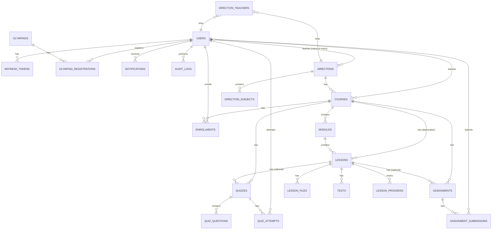

# LMS Platform - Database Documentation

> MySQL Database Schema, Relationships va ERD

**Database Type:** MySQL 8.0
**ORM:** Sequelize 6.35.2
**Migrations:** Knex.js 3.1.0
**Character Set:** utf8mb4
**Collation:** utf8mb4_unicode_ci

**Last Updated:** 2025-01-16

---

## 📋 Table of Contents

1. [Database Overview](#database-overview)
2. [Schema Overview](#schema-overview)
3. [Tables Documentation](#tables-documentation)
4. [Relationships & Associations](#relationships--associations)
5. [Indexes Strategy](#indexes-strategy)
6. [Migrations History](#migrations-history)
7. [Seeders](#seeders)
8. [ERD Diagram](#erd-diagram)
9. [Query Patterns](#query-patterns)
10. [Performance Optimization](#performance-optimization)

---

## 🗄️ Database Overview

### Database Configuration

```javascript
{
  host: process.env.DB_HOST || 'localhost',
  port: process.env.DB_PORT || 3306,
  database: process.env.DB_NAME || 'lms_platform',
  user: process.env.DB_USER || 'root',
  password: process.env.DB_PASSWORD || '',
  charset: 'utf8mb4',
  collation: 'utf8mb4_unicode_ci',
  pool: {
    min: 2,
    max: 10,
    acquire: 30000,
    idle: 10000
  }
}
```

### Database Statistics

| Metric | Value |
|--------|-------|
| **Total Tables** | 17+ |
| **Migrations** | 17 ta (Knex) |
| **Models** | 10+ ta (Sequelize) |
| **Foreign Keys** | 15+ |
| **Indexes** | 30+ |
| **Environment** | Development, Test, Production |

---

## 📊 Schema Overview

### Hierarchical Course Structure

```
Direction (Yo'nalish)
    ├── DirectionSubject (Fanlar)
    ├── DirectionTeacher (O'qituvchilar)
    └── Course (Kurs)
            ├── Module (Modul)
            │     └── Lesson (Dars)
            │           ├── LessonFile (Fayllar)
            │           └── Test (Testlar)
            ├── Quiz (Testlar)
            ├── Assignment (Topshiriqlar)
            └── Enrollment (Yozilish)
```

### Table Categories

1. **User Management** (2 jadval)
   - users
   - refresh_tokens

2. **Course System** (8 jadval)
   - directions (Sequelize)
   - direction_subjects (Sequelize)
   - direction_teachers (Sequelize)
   - courses
   - modules (Sequelize)
   - lessons
   - lesson_files (Sequelize)
   - tests (Sequelize)

3. **Progress Tracking** (3 jadval)
   - enrollments
   - lesson_progress
   - quiz_attempts

4. **Assessment** (3 jadval)
   - quizzes
   - quiz_questions
   - assignments
   - assignment_submissions

5. **Olympiad System** (2 jadval)
   - olympiads
   - olympiad_registrations

6. **Notifications & Logging** (3 jadval)
   - notifications
   - audit_logs
   - sessions

---

## 📝 Tables Documentation

### 1. users - Foydalanuvchilar

**Maqsad:** Barcha foydalanuvchilarni saqlash (Student, Teacher, Admin)

**Columns:**

| Column | Type | Nullable | Default | Index | Description |
|--------|------|----------|---------|-------|-------------|
| `id` | INT UNSIGNED | NO | AUTO_INCREMENT | PRIMARY | Foydalanuvchi ID |
| `email` | VARCHAR(255) | YES | NULL | UNIQUE | Email manzil |
| `phone` | VARCHAR(20) | YES | NULL | UNIQUE | Telefon raqam |
| `password` | VARCHAR(255) | NO | - | - | Bcrypt hash |
| `first_name` | VARCHAR(50) | NO | - | - | Ism |
| `last_name` | VARCHAR(50) | NO | - | - | Familiya |
| `role` | ENUM | NO | 'STUDENT' | INDEX | STUDENT, TEACHER, ADMIN |
| `avatar` | VARCHAR(255) | YES | NULL | - | Avatar URL |
| `status` | ENUM | NO | 'ACTIVE' | INDEX | ACTIVE, INACTIVE, SUSPENDED |
| `blocked_at` | TIMESTAMP | YES | NULL | - | Bloklangan vaqt |
| `blocked_reason` | TEXT | YES | NULL | - | Bloklash sababi |
| `last_login_at` | TIMESTAMP | YES | NULL | - | Oxirgi kirish |
| `is_active` | BOOLEAN | NO | TRUE | INDEX | Faol holat |
| `is_email_verified` | BOOLEAN | NO | FALSE | - | Email tasdiqlangan |
| `created_at` | TIMESTAMP | NO | CURRENT_TIMESTAMP | - | Yaratilgan vaqt |
| `updated_at` | TIMESTAMP | NO | CURRENT_TIMESTAMP | - | Yangilangan vaqt |

**Indexes:**
```sql
PRIMARY KEY (id)
UNIQUE KEY (email)
UNIQUE KEY (phone)
INDEX idx_role (role)
INDEX idx_status (status)
INDEX idx_is_active (is_active)
```

**Constraints:**
- Email yoki Phone kamida bittasi bo'lishi kerak (app level)
- Password kamida 6 char (validation)

**Relations:**
- hasMany: RefreshToken
- hasMany: Course (as teacher)
- hasMany: Enrollment
- hasMany: QuizAttempt
- hasMany: AssignmentSubmission
- hasMany: OlympiadRegistration
- belongsToMany: Direction (through DirectionTeacher)

---

### 2. refresh_tokens - JWT Refresh Tokenlar

**Maqsad:** Refresh token'larni saqlash

**Columns:**

| Column | Type | Nullable | Default | Index | Description |
|--------|------|----------|---------|-------|-------------|
| `id` | INT UNSIGNED | NO | AUTO_INCREMENT | PRIMARY | Token ID |
| `user_id` | INT UNSIGNED | NO | - | FOREIGN, INDEX | User ID |
| `token` | VARCHAR(500) | NO | - | UNIQUE | JWT token |
| `expires_at` | TIMESTAMP | NO | - | INDEX | Muddat |
| `created_at` | TIMESTAMP | NO | CURRENT_TIMESTAMP | - | Yaratilgan vaqt |
| `updated_at` | TIMESTAMP | NO | CURRENT_TIMESTAMP | - | Yangilangan vaqt |

**Indexes:**
```sql
PRIMARY KEY (id)
UNIQUE KEY (token)
FOREIGN KEY (user_id) REFERENCES users(id) ON DELETE CASCADE
INDEX idx_user_id (user_id)
INDEX idx_expires_at (expires_at)
```

---

### 3. directions - Yo'nalishlar (Sequelize Model)

**Maqsad:** Ta'lim yo'nalishlarini saqlash (Matematika, English, Programming)

**Columns:**

| Column | Type | Nullable | Default | Index | Description |
|--------|------|----------|---------|-------|-------------|
| `id` | INT UNSIGNED | NO | AUTO_INCREMENT | PRIMARY | Direction ID |
| `name` | VARCHAR(255) | NO | - | UNIQUE | Yo'nalish nomi |
| `description` | TEXT | YES | NULL | - | Tavsif |
| `slug` | VARCHAR(255) | NO | - | UNIQUE | URL slug |
| `icon` | VARCHAR(255) | YES | NULL | - | Icon URL |
| `status` | ENUM | NO | 'ACTIVE' | INDEX | ACTIVE, INACTIVE |
| `order` | INT UNSIGNED | NO | 0 | INDEX | Tartiblash |
| `created_at` | TIMESTAMP | NO | CURRENT_TIMESTAMP | - | Yaratilgan vaqt |
| `updated_at` | TIMESTAMP | NO | CURRENT_TIMESTAMP | - | Yangilangan vaqt |
| `deleted_at` | TIMESTAMP | YES | NULL | INDEX | Soft delete |

**Indexes:**
```sql
PRIMARY KEY (id)
UNIQUE KEY (name)
UNIQUE KEY (slug)
INDEX idx_status (status)
INDEX idx_order (order)
INDEX idx_deleted_at (deleted_at)
```

**Relations:**
- hasMany: DirectionSubject
- hasMany: Course
- belongsToMany: User (through DirectionTeacher, as teachers)

---

### 4. direction_subjects - Yo'nalish Fanlari (Sequelize Model)

**Maqsad:** Har bir yo'nalishdagi fanlarni saqlash

**Columns:**

| Column | Type | Nullable | Default | Index | Description |
|--------|------|----------|---------|-------|-------------|
| `id` | INT UNSIGNED | NO | AUTO_INCREMENT | PRIMARY | ID |
| `direction_id` | INT UNSIGNED | NO | - | FOREIGN, INDEX | Direction ID |
| `subject_name` | VARCHAR(255) | NO | - | - | Fan nomi |
| `order` | INT UNSIGNED | NO | 0 | - | Tartiblash |
| `created_at` | TIMESTAMP | NO | CURRENT_TIMESTAMP | - | Yaratilgan vaqt |
| `updated_at` | TIMESTAMP | NO | CURRENT_TIMESTAMP | - | Yangilangan vaqt |

**Indexes:**
```sql
PRIMARY KEY (id)
FOREIGN KEY (direction_id) REFERENCES directions(id) ON DELETE CASCADE
INDEX idx_direction_id (direction_id)
```

---

### 5. direction_teachers - Yo'nalish O'qituvchilari (Many-to-Many)

**Maqsad:** Direction va Teacher orasidagi bog'lanish

**Columns:**

| Column | Type | Nullable | Default | Index | Description |
|--------|------|----------|---------|-------|-------------|
| `id` | INT UNSIGNED | NO | AUTO_INCREMENT | PRIMARY | ID |
| `direction_id` | INT UNSIGNED | NO | - | FOREIGN, INDEX | Direction ID |
| `user_id` | INT UNSIGNED | NO | - | FOREIGN, INDEX | Teacher ID |
| `created_at` | TIMESTAMP | NO | CURRENT_TIMESTAMP | - | Yaratilgan vaqt |
| `updated_at` | TIMESTAMP | NO | CURRENT_TIMESTAMP | - | Yangilangan vaqt |

**Indexes:**
```sql
PRIMARY KEY (id)
UNIQUE KEY (direction_id, user_id)
FOREIGN KEY (direction_id) REFERENCES directions(id) ON DELETE CASCADE
FOREIGN KEY (user_id) REFERENCES users(id) ON DELETE CASCADE
INDEX idx_direction_id (direction_id)
INDEX idx_user_id (user_id)
```

---

### 6. courses - Kurslar

**Maqsad:** Barcha kurslarni saqlash

**Columns:**

| Column | Type | Nullable | Default | Index | Description |
|--------|------|----------|---------|-------|-------------|
| `id` | INT UNSIGNED | NO | AUTO_INCREMENT | PRIMARY | Course ID |
| `direction_id` | INT UNSIGNED | YES | NULL | FOREIGN, INDEX | Direction ID |
| `title` | VARCHAR(255) | NO | - | - | Kurs nomi |
| `description` | TEXT | NO | - | - | Tavsif |
| `subject` | ENUM | NO | - | INDEX | MATHEMATICS, ENGLISH |
| `level` | ENUM | NO | - | INDEX | BEGINNER, INTERMEDIATE, ADVANCED |
| `cover_image_url` | VARCHAR(500) | YES | NULL | - | Rasm URL |
| `duration_weeks` | INT UNSIGNED | YES | NULL | - | Davomiyligi (hafta) |
| `price` | DECIMAL(10,2) | NO | 0.00 | - | Narxi |
| `status` | ENUM | NO | 'DRAFT' | INDEX | DRAFT, PUBLISHED, ARCHIVED |
| `teacher_id` | INT UNSIGNED | YES | NULL | FOREIGN, INDEX | Teacher ID |
| `order` | INT UNSIGNED | NO | 0 | INDEX | Tartiblash |
| `created_at` | TIMESTAMP | NO | CURRENT_TIMESTAMP | - | Yaratilgan vaqt |
| `updated_at` | TIMESTAMP | NO | CURRENT_TIMESTAMP | - | Yangilangan vaqt |
| `deleted_at` | TIMESTAMP | YES | NULL | INDEX | Soft delete |

**Indexes:**
```sql
PRIMARY KEY (id)
FOREIGN KEY (direction_id) REFERENCES directions(id) ON DELETE SET NULL
FOREIGN KEY (teacher_id) REFERENCES users(id) ON DELETE SET NULL
INDEX idx_subject (subject)
INDEX idx_level (level)
INDEX idx_status (status)
INDEX idx_teacher_id (teacher_id)
INDEX idx_order (order)
INDEX idx_deleted_at (deleted_at)
```

---

### 7. modules - Modullar (Sequelize Model)

**Maqsad:** Kurs ichidagi modullarni saqlash

**Columns:**

| Column | Type | Nullable | Default | Index | Description |
|--------|------|----------|---------|-------|-------------|
| `id` | INT UNSIGNED | NO | AUTO_INCREMENT | PRIMARY | Module ID |
| `course_id` | INT UNSIGNED | NO | - | FOREIGN, INDEX | Course ID |
| `title` | VARCHAR(255) | NO | - | - | Modul nomi |
| `description` | TEXT | YES | NULL | - | Tavsif |
| `order` | INT UNSIGNED | NO | 0 | INDEX | Tartiblash |
| `status` | ENUM | NO | 'DRAFT' | INDEX | DRAFT, PUBLISHED |
| `created_at` | TIMESTAMP | NO | CURRENT_TIMESTAMP | - | Yaratilgan vaqt |
| `updated_at` | TIMESTAMP | NO | CURRENT_TIMESTAMP | - | Yangilangan vaqt |
| `deleted_at` | TIMESTAMP | YES | NULL | INDEX | Soft delete |

**Indexes:**
```sql
PRIMARY KEY (id)
FOREIGN KEY (course_id) REFERENCES courses(id) ON DELETE CASCADE
INDEX idx_course_id (course_id)
INDEX idx_order (order)
INDEX idx_status (status)
INDEX idx_deleted_at (deleted_at)
```

---

### 8. lessons - Darslar

**Maqsad:** Modul ichidagi darslarni saqlash

**Columns:**

| Column | Type | Nullable | Default | Index | Description |
|--------|------|----------|---------|-------|-------------|
| `id` | INT UNSIGNED | NO | AUTO_INCREMENT | PRIMARY | Lesson ID |
| `course_id` | INT UNSIGNED | NO | - | FOREIGN, INDEX | Course ID (deprecated) |
| `module_id` | INT UNSIGNED | YES | NULL | FOREIGN, INDEX | Module ID |
| `title` | VARCHAR(255) | NO | - | - | Dars nomi |
| `description` | TEXT | YES | NULL | - | Tavsif |
| `content` | TEXT | YES | NULL | - | Dars matni |
| `video_url` | VARCHAR(500) | YES | NULL | - | Video URL |
| `duration_minutes` | INT UNSIGNED | YES | NULL | - | Davomiyligi (daqiqa) |
| `order` | INT UNSIGNED | NO | 0 | INDEX | Tartiblash |
| `status` | ENUM | NO | 'DRAFT' | INDEX | DRAFT, PUBLISHED |
| `created_at` | TIMESTAMP | NO | CURRENT_TIMESTAMP | - | Yaratilgan vaqt |
| `updated_at` | TIMESTAMP | NO | CURRENT_TIMESTAMP | - | Yangilangan vaqt |
| `deleted_at` | TIMESTAMP | YES | NULL | INDEX | Soft delete |

**Indexes:**
```sql
PRIMARY KEY (id)
FOREIGN KEY (course_id) REFERENCES courses(id) ON DELETE CASCADE
FOREIGN KEY (module_id) REFERENCES modules(id) ON DELETE CASCADE
INDEX idx_course_id (course_id)
INDEX idx_module_id (module_id)
INDEX idx_status (status)
INDEX idx_order (order)
INDEX idx_deleted_at (deleted_at)
```

---

### 9. lesson_files - Dars Fayllari (Sequelize Model)

**Maqsad:** Darsga biriktirilgan fayllarni saqlash

**Columns:**

| Column | Type | Nullable | Default | Index | Description |
|--------|------|----------|---------|-------|-------------|
| `id` | INT UNSIGNED | NO | AUTO_INCREMENT | PRIMARY | File ID |
| `lesson_id` | INT UNSIGNED | NO | - | FOREIGN, INDEX | Lesson ID |
| `file_name` | VARCHAR(255) | NO | - | - | Fayl nomi |
| `file_url` | VARCHAR(500) | NO | - | - | Fayl URL |
| `file_type` | VARCHAR(50) | YES | NULL | - | Fayl turi (PDF, DOCX, etc.) |
| `file_size` | INT UNSIGNED | YES | NULL | - | Fayl hajmi (bytes) |
| `order` | INT UNSIGNED | NO | 0 | - | Tartiblash |
| `created_at` | TIMESTAMP | NO | CURRENT_TIMESTAMP | - | Yaratilgan vaqt |
| `updated_at` | TIMESTAMP | NO | CURRENT_TIMESTAMP | - | Yangilangan vaqt |

**Indexes:**
```sql
PRIMARY KEY (id)
FOREIGN KEY (lesson_id) REFERENCES lessons(id) ON DELETE CASCADE
INDEX idx_lesson_id (lesson_id)
```

---

### 10. tests - Testlar (Sequelize Model)

**Maqsad:** Darsga biriktirilgan testlarni saqlash

**Columns:**

| Column | Type | Nullable | Default | Index | Description |
|--------|------|----------|---------|-------|-------------|
| `id` | INT UNSIGNED | NO | AUTO_INCREMENT | PRIMARY | Test ID |
| `lesson_id` | INT UNSIGNED | NO | - | FOREIGN, INDEX | Lesson ID |
| `title` | VARCHAR(255) | NO | - | - | Test nomi |
| `description` | TEXT | YES | NULL | - | Tavsif |
| `questions` | JSON | NO | - | - | Savollar (JSON format) |
| `duration_minutes` | INT UNSIGNED | YES | NULL | - | Davomiyligi (daqiqa) |
| `passing_score` | INT UNSIGNED | NO | 70 | - | O'tish bali (%) |
| `max_attempts` | INT UNSIGNED | NO | 3 | - | Maksimal urinishlar |
| `status` | ENUM | NO | 'DRAFT' | INDEX | DRAFT, PUBLISHED |
| `created_at` | TIMESTAMP | NO | CURRENT_TIMESTAMP | - | Yaratilgan vaqt |
| `updated_at` | TIMESTAMP | NO | CURRENT_TIMESTAMP | - | Yangilangan vaqt |
| `deleted_at` | TIMESTAMP | YES | NULL | INDEX | Soft delete |

**Indexes:**
```sql
PRIMARY KEY (id)
FOREIGN KEY (lesson_id) REFERENCES lessons(id) ON DELETE CASCADE
INDEX idx_lesson_id (lesson_id)
INDEX idx_status (status)
INDEX idx_deleted_at (deleted_at)
```

**JSON Structure (questions):**
```json
[
  {
    "id": 1,
    "question": "2 + 2 nechaga teng?",
    "type": "MULTIPLE_CHOICE",
    "options": ["2", "3", "4", "5"],
    "correctAnswer": "4",
    "points": 10
  }
]
```

---

### 11. enrollments - Kursga Yozilish

**Maqsad:** O'quvchilarning kurslarga yozilishini kuzatish

**Columns:**

| Column | Type | Nullable | Default | Index | Description |
|--------|------|----------|---------|-------|-------------|
| `id` | INT UNSIGNED | NO | AUTO_INCREMENT | PRIMARY | Enrollment ID |
| `user_id` | INT UNSIGNED | NO | - | FOREIGN, INDEX | Student ID |
| `course_id` | INT UNSIGNED | NO | - | FOREIGN, INDEX | Course ID |
| `status` | ENUM | NO | 'ENROLLED' | INDEX | ENROLLED, IN_PROGRESS, COMPLETED, DROPPED |
| `progress_percentage` | INT UNSIGNED | NO | 0 | - | Progress (%) |
| `grade` | DECIMAL(5,2) | YES | NULL | - | Baho |
| `enrolled_at` | TIMESTAMP | NO | CURRENT_TIMESTAMP | - | Yozilgan vaqt |
| `completed_at` | TIMESTAMP | YES | NULL | - | Tugatgan vaqt |
| `created_at` | TIMESTAMP | NO | CURRENT_TIMESTAMP | - | Yaratilgan vaqt |
| `updated_at` | TIMESTAMP | NO | CURRENT_TIMESTAMP | - | Yangilangan vaqt |

**Indexes:**
```sql
PRIMARY KEY (id)
UNIQUE KEY (user_id, course_id)
FOREIGN KEY (user_id) REFERENCES users(id) ON DELETE CASCADE
FOREIGN KEY (course_id) REFERENCES courses(id) ON DELETE CASCADE
INDEX idx_user_id (user_id)
INDEX idx_course_id (course_id)
INDEX idx_status (status)
```

---

### 12. lesson_progress - Dars Jarayoni

**Maqsad:** O'quvchilarning darslarni tugatishini kuzatish

**Columns:**

| Column | Type | Nullable | Default | Index | Description |
|--------|------|----------|---------|-------|-------------|
| `id` | INT UNSIGNED | NO | AUTO_INCREMENT | PRIMARY | Progress ID |
| `user_id` | INT UNSIGNED | NO | - | FOREIGN, INDEX | Student ID |
| `lesson_id` | INT UNSIGNED | NO | - | FOREIGN, INDEX | Lesson ID |
| `completed` | BOOLEAN | NO | FALSE | INDEX | Tugatilgan |
| `completed_at` | TIMESTAMP | YES | NULL | - | Tugatilgan vaqt |
| `created_at` | TIMESTAMP | NO | CURRENT_TIMESTAMP | - | Yaratilgan vaqt |
| `updated_at` | TIMESTAMP | NO | CURRENT_TIMESTAMP | - | Yangilangan vaqt |

**Indexes:**
```sql
PRIMARY KEY (id)
UNIQUE KEY (user_id, lesson_id)
FOREIGN KEY (user_id) REFERENCES users(id) ON DELETE CASCADE
FOREIGN KEY (lesson_id) REFERENCES lessons(id) ON DELETE CASCADE
INDEX idx_user_id (user_id)
INDEX idx_lesson_id (lesson_id)
INDEX idx_completed (completed)
```

---

### 13. quizzes - Testlar

**Maqsad:** Kurs yoki darsga bog'langan testlar

**Columns:**

| Column | Type | Nullable | Default | Index | Description |
|--------|------|----------|---------|-------|-------------|
| `id` | INT UNSIGNED | NO | AUTO_INCREMENT | PRIMARY | Quiz ID |
| `course_id` | INT UNSIGNED | NO | - | FOREIGN, INDEX | Course ID |
| `lesson_id` | INT UNSIGNED | YES | NULL | FOREIGN, INDEX | Lesson ID (optional) |
| `title` | VARCHAR(255) | NO | - | - | Test nomi |
| `description` | TEXT | YES | NULL | - | Tavsif |
| `duration_minutes` | INT UNSIGNED | YES | NULL | - | Davomiyligi (daqiqa) |
| `passing_score` | INT UNSIGNED | NO | 70 | - | O'tish bali (%) |
| `max_attempts` | INT UNSIGNED | NO | 3 | - | Maksimal urinishlar |
| `status` | ENUM | NO | 'DRAFT' | INDEX | DRAFT, PUBLISHED |
| `created_at` | TIMESTAMP | NO | CURRENT_TIMESTAMP | - | Yaratilgan vaqt |
| `updated_at` | TIMESTAMP | NO | CURRENT_TIMESTAMP | - | Yangilangan vaqt |
| `deleted_at` | TIMESTAMP | YES | NULL | INDEX | Soft delete |

**Indexes:**
```sql
PRIMARY KEY (id)
FOREIGN KEY (course_id) REFERENCES courses(id) ON DELETE CASCADE
FOREIGN KEY (lesson_id) REFERENCES lessons(id) ON DELETE SET NULL
INDEX idx_course_id (course_id)
INDEX idx_lesson_id (lesson_id)
INDEX idx_status (status)
INDEX idx_deleted_at (deleted_at)
```

---

### 14. quiz_questions - Test Savollari

**Maqsad:** Quiz savollari

**Columns:**

| Column | Type | Nullable | Default | Index | Description |
|--------|------|----------|---------|-------|-------------|
| `id` | INT UNSIGNED | NO | AUTO_INCREMENT | PRIMARY | Question ID |
| `quiz_id` | INT UNSIGNED | NO | - | FOREIGN, INDEX | Quiz ID |
| `question_text` | TEXT | NO | - | - | Savol matni |
| `question_type` | ENUM | NO | - | - | MULTIPLE_CHOICE, TRUE_FALSE, SHORT_ANSWER |
| `options` | JSON | YES | NULL | - | Variantlar (JSON) |
| `correct_answer` | TEXT | NO | - | - | To'g'ri javob |
| `points` | INT UNSIGNED | NO | 1 | - | Ball |
| `created_at` | TIMESTAMP | NO | CURRENT_TIMESTAMP | - | Yaratilgan vaqt |
| `updated_at` | TIMESTAMP | NO | CURRENT_TIMESTAMP | - | Yangilangan vaqt |

**Indexes:**
```sql
PRIMARY KEY (id)
FOREIGN KEY (quiz_id) REFERENCES quizzes(id) ON DELETE CASCADE
INDEX idx_quiz_id (quiz_id)
```

---

### 15. quiz_attempts - Test Urinishlari

**Maqsad:** O'quvchilarning test urinishlarini kuzatish

**Columns:**

| Column | Type | Nullable | Default | Index | Description |
|--------|------|----------|---------|-------|-------------|
| `id` | INT UNSIGNED | NO | AUTO_INCREMENT | PRIMARY | Attempt ID |
| `quiz_id` | INT UNSIGNED | NO | - | FOREIGN, INDEX | Quiz ID |
| `user_id` | INT UNSIGNED | NO | - | FOREIGN, INDEX | Student ID |
| `score` | INT UNSIGNED | YES | NULL | - | Ball |
| `total_points` | INT UNSIGNED | YES | NULL | - | Jami ball |
| `passed` | BOOLEAN | YES | NULL | INDEX | O'tgan/O'tmagan |
| `answers` | JSON | YES | NULL | - | Javoblar (JSON) |
| `started_at` | TIMESTAMP | YES | NULL | - | Boshlangan vaqt |
| `submitted_at` | TIMESTAMP | YES | NULL | - | Topshirilgan vaqt |
| `created_at` | TIMESTAMP | NO | CURRENT_TIMESTAMP | - | Yaratilgan vaqt |
| `updated_at` | TIMESTAMP | NO | CURRENT_TIMESTAMP | - | Yangilangan vaqt |

**Indexes:**
```sql
PRIMARY KEY (id)
FOREIGN KEY (quiz_id) REFERENCES quizzes(id) ON DELETE CASCADE
FOREIGN KEY (user_id) REFERENCES users(id) ON DELETE CASCADE
INDEX idx_quiz_id (quiz_id)
INDEX idx_user_id (user_id)
INDEX idx_passed (passed)
```

---

### 16. assignments - Topshiriqlar

**Maqsad:** Kurs topshiriqlari

**Columns:**

| Column | Type | Nullable | Default | Index | Description |
|--------|------|----------|---------|-------|-------------|
| `id` | INT UNSIGNED | NO | AUTO_INCREMENT | PRIMARY | Assignment ID |
| `course_id` | INT UNSIGNED | NO | - | FOREIGN, INDEX | Course ID |
| `lesson_id` | INT UNSIGNED | YES | NULL | FOREIGN, INDEX | Lesson ID (optional) |
| `title` | VARCHAR(255) | NO | - | - | Topshiriq nomi |
| `description` | TEXT | NO | - | - | Tavsif |
| `due_date` | TIMESTAMP | YES | NULL | INDEX | Topshirish muddati |
| `max_points` | INT UNSIGNED | YES | NULL | - | Maksimal ball |
| `status` | ENUM | NO | 'DRAFT' | INDEX | DRAFT, PUBLISHED, CLOSED |
| `created_at` | TIMESTAMP | NO | CURRENT_TIMESTAMP | - | Yaratilgan vaqt |
| `updated_at` | TIMESTAMP | NO | CURRENT_TIMESTAMP | - | Yangilangan vaqt |
| `deleted_at` | TIMESTAMP | YES | NULL | INDEX | Soft delete |

**Indexes:**
```sql
PRIMARY KEY (id)
FOREIGN KEY (course_id) REFERENCES courses(id) ON DELETE CASCADE
FOREIGN KEY (lesson_id) REFERENCES lessons(id) ON DELETE SET NULL
INDEX idx_course_id (course_id)
INDEX idx_lesson_id (lesson_id)
INDEX idx_status (status)
INDEX idx_due_date (due_date)
INDEX idx_deleted_at (deleted_at)
```

---

### 17. assignment_submissions - Topshiriq Javoblari

**Maqsad:** O'quvchilarning topshiriq javoblari

**Columns:**

| Column | Type | Nullable | Default | Index | Description |
|--------|------|----------|---------|-------|-------------|
| `id` | INT UNSIGNED | NO | AUTO_INCREMENT | PRIMARY | Submission ID |
| `assignment_id` | INT UNSIGNED | NO | - | FOREIGN, INDEX | Assignment ID |
| `user_id` | INT UNSIGNED | NO | - | FOREIGN, INDEX | Student ID |
| `content` | TEXT | YES | NULL | - | Javob matni |
| `file_url` | VARCHAR(500) | YES | NULL | - | Fayl URL |
| `grade` | INT UNSIGNED | YES | NULL | - | Baho |
| `feedback` | TEXT | YES | NULL | - | O'qituvchi izohi |
| `status` | ENUM | NO | 'SUBMITTED' | INDEX | SUBMITTED, GRADED, RETURNED |
| `submitted_at` | TIMESTAMP | YES | NULL | - | Topshirilgan vaqt |
| `graded_at` | TIMESTAMP | YES | NULL | - | Baholangan vaqt |
| `created_at` | TIMESTAMP | NO | CURRENT_TIMESTAMP | - | Yaratilgan vaqt |
| `updated_at` | TIMESTAMP | NO | CURRENT_TIMESTAMP | - | Yangilangan vaqt |

**Indexes:**
```sql
PRIMARY KEY (id)
FOREIGN KEY (assignment_id) REFERENCES assignments(id) ON DELETE CASCADE
FOREIGN KEY (user_id) REFERENCES users(id) ON DELETE CASCADE
INDEX idx_assignment_id (assignment_id)
INDEX idx_user_id (user_id)
INDEX idx_status (status)
```

---

### 18. olympiads - Olimpiadalar

**Maqsad:** Olimpiadalarni saqlash

**Columns:**

| Column | Type | Nullable | Default | Index | Description |
|--------|------|----------|---------|-------|-------------|
| `id` | INT UNSIGNED | NO | AUTO_INCREMENT | PRIMARY | Olympiad ID |
| `title` | VARCHAR(255) | NO | - | - | Olimpiada nomi |
| `description` | TEXT | YES | NULL | - | Tavsif |
| `subject` | ENUM | NO | - | INDEX | MATHEMATICS, ENGLISH |
| `level` | ENUM | NO | - | INDEX | REGIONAL, NATIONAL, INTERNATIONAL |
| `start_date` | DATETIME | NO | - | INDEX | Boshlash vaqti |
| `end_date` | DATETIME | NO | - | - | Tugash vaqti |
| `registration_deadline` | DATETIME | NO | - | - | Ro'yxatdan o'tish muddati |
| `max_participants` | INT UNSIGNED | YES | NULL | - | Maksimal qatnashchilar |
| `duration_minutes` | INT UNSIGNED | NO | - | - | Davomiyligi (daqiqa) |
| `status` | ENUM | NO | 'UPCOMING' | INDEX | UPCOMING, REGISTRATION_OPEN, IN_PROGRESS, COMPLETED, CANCELLED |
| `created_at` | TIMESTAMP | NO | CURRENT_TIMESTAMP | - | Yaratilgan vaqt |
| `updated_at` | TIMESTAMP | NO | CURRENT_TIMESTAMP | - | Yangilangan vaqt |

**Indexes:**
```sql
PRIMARY KEY (id)
INDEX idx_subject (subject)
INDEX idx_level (level)
INDEX idx_status (status)
INDEX idx_start_date (start_date)
```

---

### 19. olympiad_registrations - Olimpiada Ro'yxati

**Maqsad:** Olimpiadaga ro'yxatdan o'tish

**Columns:**

| Column | Type | Nullable | Default | Index | Description |
|--------|------|----------|---------|-------|-------------|
| `id` | INT UNSIGNED | NO | AUTO_INCREMENT | PRIMARY | Registration ID |
| `olympiad_id` | INT UNSIGNED | NO | - | FOREIGN, INDEX | Olympiad ID |
| `user_id` | INT UNSIGNED | NO | - | FOREIGN, INDEX | Student ID |
| `status` | ENUM | NO | 'REGISTERED' | INDEX | REGISTERED, CONFIRMED, PARTICIPATED, DISQUALIFIED |
| `score` | INT UNSIGNED | YES | NULL | - | Ball |
| `rank` | INT UNSIGNED | YES | NULL | INDEX | Reyting |
| `registered_at` | TIMESTAMP | NO | CURRENT_TIMESTAMP | - | Ro'yxatdan o'tgan vaqt |
| `created_at` | TIMESTAMP | NO | CURRENT_TIMESTAMP | - | Yaratilgan vaqt |
| `updated_at` | TIMESTAMP | NO | CURRENT_TIMESTAMP | - | Yangilangan vaqt |

**Indexes:**
```sql
PRIMARY KEY (id)
UNIQUE KEY (olympiad_id, user_id)
FOREIGN KEY (olympiad_id) REFERENCES olympiads(id) ON DELETE CASCADE
FOREIGN KEY (user_id) REFERENCES users(id) ON DELETE CASCADE
INDEX idx_olympiad_id (olympiad_id)
INDEX idx_user_id (user_id)
INDEX idx_status (status)
INDEX idx_rank (rank)
```

---

### 20. notifications - Bildirishnomalar

**Maqsad:** Foydalanuvchi bildirishnomalarini saqlash

**Columns:**

| Column | Type | Nullable | Default | Index | Description |
|--------|------|----------|---------|-------|-------------|
| `id` | INT UNSIGNED | NO | AUTO_INCREMENT | PRIMARY | Notification ID |
| `user_id` | INT UNSIGNED | NO | - | FOREIGN, INDEX | User ID |
| `title` | VARCHAR(255) | NO | - | - | Sarlavha |
| `message` | TEXT | NO | - | - | Xabar |
| `type` | ENUM | NO | 'INFO' | - | INFO, SUCCESS, WARNING, ERROR |
| `category` | ENUM | NO | 'SYSTEM' | - | COURSE, ASSIGNMENT, QUIZ, OLYMPIAD, SYSTEM |
| `read` | BOOLEAN | NO | FALSE | INDEX | O'qilgan |
| `read_at` | TIMESTAMP | YES | NULL | - | O'qilgan vaqt |
| `created_at` | TIMESTAMP | NO | CURRENT_TIMESTAMP | - | Yaratilgan vaqt |

**Indexes:**
```sql
PRIMARY KEY (id)
FOREIGN KEY (user_id) REFERENCES users(id) ON DELETE CASCADE
INDEX idx_user_id (user_id)
INDEX idx_read (read)
```

---

### 21. sessions - Sessiyalar

**Maqsad:** Express session'larni saqlash

**Columns:**

| Column | Type | Nullable | Default | Index | Description |
|--------|------|----------|---------|-------|-------------|
| `sid` | VARCHAR(255) | NO | - | PRIMARY | Session ID |
| `sess` | JSON | NO | - | - | Session ma'lumotlari |
| `expire` | TIMESTAMP | NO | - | INDEX | Muddat |

**Indexes:**
```sql
PRIMARY KEY (sid)
INDEX idx_expire (expire)
```

---

### 22. audit_logs - Audit Loglar

**Maqsad:** Foydalanuvchi harakatlarini kuzatish

**Columns:**

| Column | Type | Nullable | Default | Index | Description |
|--------|------|----------|---------|-------|-------------|
| `id` | INT UNSIGNED | NO | AUTO_INCREMENT | PRIMARY | Log ID |
| `user_id` | INT UNSIGNED | YES | NULL | FOREIGN, INDEX | User ID |
| `action` | VARCHAR(100) | NO | - | INDEX | CREATE, UPDATE, DELETE, etc. |
| `entity_type` | VARCHAR(50) | YES | NULL | - | Entity turi (User, Course, etc.) |
| `entity_id` | INT UNSIGNED | YES | NULL | - | Entity ID |
| `changes` | JSON | YES | NULL | - | O'zgarishlar (JSON) |
| `ip_address` | VARCHAR(45) | YES | NULL | - | IP manzil |
| `user_agent` | TEXT | YES | NULL | - | User agent |
| `created_at` | TIMESTAMP | NO | CURRENT_TIMESTAMP | INDEX | Yaratilgan vaqt |

**Indexes:**
```sql
PRIMARY KEY (id)
FOREIGN KEY (user_id) REFERENCES users(id) ON DELETE SET NULL
INDEX idx_user_id (user_id)
INDEX idx_action (action)
INDEX idx_created_at (created_at)
```

---

## 🔗 Relationships & Associations

### Entity Relationship Diagram (ERD)



### Sequelize Model Associations

```javascript
// User associations
User.hasMany(RefreshToken, { foreignKey: 'userId', as: 'refreshTokens' });
User.hasMany(Course, { foreignKey: 'teacherId', as: 'courses' });
User.hasMany(Enrollment, { foreignKey: 'userId', as: 'enrollments' });
User.hasMany(QuizAttempt, { foreignKey: 'userId', as: 'quizAttempts' });
User.hasMany(AssignmentSubmission, { foreignKey: 'userId', as: 'submissions' });
User.hasMany(OlympiadRegistration, { foreignKey: 'userId', as: 'olympiadRegistrations' });
User.hasMany(Notification, { foreignKey: 'userId', as: 'notifications' });
User.belongsToMany(Direction, {
  through: DirectionTeacher,
  foreignKey: 'userId',
  otherKey: 'directionId',
  as: 'directions'
});

// Direction associations
Direction.hasMany(DirectionSubject, { foreignKey: 'directionId', as: 'subjects' });
Direction.hasMany(Course, { foreignKey: 'directionId', as: 'courses' });
Direction.belongsToMany(User, {
  through: DirectionTeacher,
  foreignKey: 'directionId',
  otherKey: 'userId',
  as: 'teachers'
});

// Course associations
Course.belongsTo(Direction, { foreignKey: 'directionId', as: 'direction' });
Course.belongsTo(User, { foreignKey: 'teacherId', as: 'teacher' });
Course.hasMany(Module, { foreignKey: 'courseId', as: 'modules' });
Course.hasMany(Enrollment, { foreignKey: 'courseId', as: 'enrollments' });
Course.hasMany(Quiz, { foreignKey: 'courseId', as: 'quizzes' });
Course.hasMany(Assignment, { foreignKey: 'courseId', as: 'assignments' });

// Module associations
Module.belongsTo(Course, { foreignKey: 'courseId', as: 'course' });
Module.hasMany(Lesson, { foreignKey: 'moduleId', as: 'lessons' });

// Lesson associations
Lesson.belongsTo(Module, { foreignKey: 'moduleId', as: 'module' });
Lesson.hasMany(LessonFile, { foreignKey: 'lessonId', as: 'files' });
Lesson.hasMany(Test, { foreignKey: 'lessonId', as: 'tests' });
Lesson.hasMany(LessonProgress, { foreignKey: 'lessonId', as: 'progress' });

// Quiz associations
Quiz.belongsTo(Course, { foreignKey: 'courseId', as: 'course' });
Quiz.belongsTo(Lesson, { foreignKey: 'lessonId', as: 'lesson' });
Quiz.hasMany(QuizQuestion, { foreignKey: 'quizId', as: 'questions' });
Quiz.hasMany(QuizAttempt, { foreignKey: 'quizId', as: 'attempts' });

// Olympiad associations
Olympiad.hasMany(OlympiadRegistration, { foreignKey: 'olympiadId', as: 'registrations' });
OlympiadRegistration.belongsTo(Olympiad, { foreignKey: 'olympiadId', as: 'olympiad' });
OlympiadRegistration.belongsTo(User, { foreignKey: 'userId', as: 'user' });
```

---

## 📊 Indexes Strategy

### Primary Keys
- Barcha jadvallarda `id` (AUTO_INCREMENT)
- `sessions` jadvalida `sid` (VARCHAR)

### Unique Indexes
- `users.email` - Email unique
- `users.phone` - Phone unique
- `refresh_tokens.token` - Token unique
- `directions.name` - Direction nomi unique
- `directions.slug` - Slug unique
- `enrollments (user_id, course_id)` - Bir kursga bir marta yozilish
- `lesson_progress (user_id, lesson_id)` - Bir darsni bir marta tugat ish
- `olympiad_registrations (olympiad_id, user_id)` - Bir olimpiadaga bir marta ro'yxatdan o'tish

### Foreign Key Indexes
- Barcha foreign key'larda avtomatik index
- Tezkor JOIN operations uchun

### Performance Indexes
- `users.role` - Role bo'yicha filter
- `users.status` - Status bo'yicha filter
- `users.is_active` - Active users filter
- `courses.subject` - Subject bo'yicha filter
- `courses.level` - Level bo'yicha filter
- `courses.status` - Status bo'yicha filter
- `courses.order` - Tartiblash
- `modules.order` - Tartiblash
- `lessons.order` - Tartiblash
- `lesson_progress.completed` - Completed lessons
- `quizzes.status` - Published quizzes
- `quiz_attempts.passed` - Passed attempts
- `olympiads.start_date` - Upcoming olympiads
- `notifications.read` - Unread notifications

### Soft Delete Indexes
- `courses.deleted_at`
- `modules.deleted_at`
- `lessons.deleted_at`
- `quizzes.deleted_at`
- `assignments.deleted_at`
- `directions.deleted_at`
- `tests.deleted_at`

---

## 📜 Migrations History

### Knex Migrations (17 ta)

| # | Migration File | Description | Date |
|---|----------------|-------------|------|
| 1 | `20250101000001_create_users_table.js` | Users jadvali | 2025-01-01 |
| 2 | `20250101000002_create_courses_table.js` | Courses jadvali | 2025-01-01 |
| 3 | `20250101000003_create_enrollments_table.js` | Enrollments jadvali | 2025-01-01 |
| 4 | `20250101000004_create_lessons_table.js` | Lessons jadvali | 2025-01-01 |
| 5 | `20250101000005_create_lesson_progress_table.js` | Lesson progress jadvali | 2025-01-01 |
| 6 | `20250101000006_create_quizzes_table.js` | Quizzes jadvali | 2025-01-01 |
| 7 | `20250101000007_create_quiz_questions_table.js` | Quiz questions jadvali | 2025-01-01 |
| 8 | `20250101000008_create_quiz_attempts_table.js` | Quiz attempts jadvali | 2025-01-01 |
| 9 | `20250101000009_create_assignments_table.js` | Assignments jadvali | 2025-01-01 |
| 10 | `20250101000010_create_assignment_submissions_table.js` | Assignment submissions | 2025-01-01 |
| 11 | `20250101000011_create_olympiads_table.js` | Olympiads jadvali | 2025-01-01 |
| 12 | `20250101000012_create_olympiad_registrations_table.js` | Olympiad registrations | 2025-01-01 |
| 13 | `20250101000013_create_notifications_table.js` | Notifications jadvali | 2025-01-01 |
| 14 | `20250101000014_create_sessions_table.js` | Sessions jadvali | 2025-01-01 |
| 15 | `20250101000015_create_refresh_tokens_table.js` | Refresh tokens jadvali | 2025-01-01 |
| 16 | `20250101000016_create_audit_logs_table.js` | Audit logs jadvali | 2025-01-01 |
| 17 | `20250101000017_add_user_status_fields.js` | User status fields qo'shish | 2025-01-01 |

### Migration Commands

```bash
# Barcha migratsiyalarni ishga tushirish
npm run migrate:latest

# Migratsiya holatini tekshirish
npx knex migrate:status

# Oxirgi migratsiyani bekor qilish
npm run migrate:rollback

# Yangi migratsiya yaratish
npx knex migrate:make migration_name
```

---

## 🌱 Seeders

### Seeder Files

| # | Seeder File | Description |
|---|-------------|-------------|
| 1 | `001_initial_users.js` | Demo users (admin, student, teacher) |

### Seeder ma'lumotlari

**Demo Users:**

```javascript
// Admin
{
  email: 'admin@lms.uz',
  password: 'admin123',  // bcrypt hash
  role: 'ADMIN',
  firstName: 'Admin',
  lastName: 'User'
}

// Student
{
  email: 'student@lms.uz',
  password: 'student123',
  role: 'STUDENT',
  firstName: 'Student',
  lastName: 'User'
}

// Teacher
{
  email: 'teacher@lms.uz',
  password: 'teacher123',
  role: 'TEACHER',
  firstName: 'Teacher',
  lastName: 'User'
}
```

### Seeder Commands

```bash
# Barcha seeder'larni ishga tushirish
npm run seed:run

# Yangi seeder yaratish
npx knex seed:make seeder_name
```

---

## 🔍 Query Patterns

### Common Queries

#### 1. Get User with Refresh Tokens

```javascript
const user = await User.findByPk(userId, {
  include: [
    {
      model: RefreshToken,
      as: 'refreshTokens',
      where: {
        expiresAt: {
          [Op.gt]: new Date()
        }
      },
      required: false
    }
  ]
});
```

#### 2. Get Course with Modules and Lessons

```javascript
const course = await Course.findByPk(courseId, {
  include: [
    {
      model: Module,
      as: 'modules',
      include: [
        {
          model: Lesson,
          as: 'lessons',
          include: [
            { model: LessonFile, as: 'files' },
            { model: Test, as: 'tests' }
          ]
        }
      ],
      order: [['order', 'ASC']]
    }
  ]
});
```

#### 3. Get Student Progress

```javascript
const progress = await LessonProgress.findAll({
  where: { userId },
  include: [
    {
      model: Lesson,
      as: 'lesson',
      include: [
        {
          model: Module,
          as: 'module',
          include: [
            {
              model: Course,
              as: 'course'
            }
          ]
        }
      ]
    }
  ]
});
```

#### 4. Get Upcoming Olympiads

```javascript
const olympiads = await Olympiad.findAll({
  where: {
    startDate: {
      [Op.gt]: new Date()
    },
    status: 'REGISTRATION_OPEN'
  },
  order: [['startDate', 'ASC']]
});
```

### N+1 Query Prevention

**❌ N+1 Query:**

```javascript
const courses = await Course.findAll();
for (const course of courses) {
  const teacher = await User.findByPk(course.teacherId);  // N+1
}
```

**✅ Eager Loading:**

```javascript
const courses = await Course.findAll({
  include: [
    {
      model: User,
      as: 'teacher',
      attributes: ['id', 'firstName', 'lastName', 'email']
    }
  ]
});
```

---

## ⚡ Performance Optimization

### Database Query Optimization

1. **Use Indexes:**
   - Foreign keys
   - Filter fields (status, role, etc.)
   - Sort fields (order, created_at)

2. **Limit Columns:**
   ```javascript
   // ❌ Yomon
   const users = await User.findAll();

   // ✅ Yaxshi
   const users = await User.findAll({
     attributes: ['id', 'email', 'firstName', 'lastName']
   });
   ```

3. **Pagination:**
   ```javascript
   const { count, rows } = await User.findAndCountAll({
     limit: 10,
     offset: (page - 1) * 10,
     order: [['createdAt', 'DESC']]
   });
   ```

4. **Eager Loading:**
   - Include related models in one query
   - Prevent N+1 queries

5. **Connection Pooling:**
   ```javascript
   pool: {
     min: 2,
     max: 10,
     acquire: 30000,
     idle: 10000
   }
   ```

### Indexing Best Practices

1. **Foreign Keys:** Always indexed
2. **Filter Fields:** Status, role, type
3. **Sort Fields:** Order, created_at
4. **Unique Constraints:** Email, phone, token
5. **Composite Indexes:** (user_id, course_id), (user_id, lesson_id)

### Query Performance Monitoring

```javascript
// Enable query logging
const sequelize = new Sequelize({
  ...config,
  logging: (sql, timing) => {
    if (timing > 1000) {  // Slow query (> 1s)
      logger.warn('Slow query detected:', { sql, timing });
    }
  },
  benchmark: true
});
```

---

## 📚 Additional Resources

### Sequelize Documentation
- [Models](https://sequelize.org/docs/v6/core-concepts/model-basics/)
- [Associations](https://sequelize.org/docs/v6/core-concepts/assocs/)
- [Querying](https://sequelize.org/docs/v6/core-concepts/model-querying-basics/)
- [Migrations](https://sequelize.org/docs/v6/other-topics/migrations/)

### Knex.js Documentation
- [Migrations](http://knexjs.org/#Migrations)
- [Seeds](http://knexjs.org/#Seeds-CLI)
- [Schema Builder](http://knexjs.org/#Schema)

### MySQL Documentation
- [Data Types](https://dev.mysql.com/doc/refman/8.0/en/data-types.html)
- [Indexes](https://dev.mysql.com/doc/refman/8.0/en/mysql-indexes.html)
- [Foreign Keys](https://dev.mysql.com/doc/refman/8.0/en/create-table-foreign-keys.html)

---

## 🎯 Xulosa

LMS Platform database professional darajada loyihalashtirilgan va quyidagi xususiyatlarga ega:

✅ **Strengths:**
- Hierarchical course structure (Direction → Course → Module → Lesson → Test)
- Comprehensive progress tracking
- Proper relationships va foreign keys
- Indexing strategy for performance
- Soft delete support
- Sequelize ORM + Knex migrations
- Audit logging

⚠️ **Takomillashtirish kerak:**
- Caching layer (Redis)
- Full-text search
- Database replication (read replicas)
- Automated backups
- Query optimization (slow query log)
- Database monitoring

---

**Last Updated:** 2025-01-16
**Database Version:** 1.0
**Total Tables:** 17+
**Total Indexes:** 30+

**🗄️ Professional database design for professional education platform!**
